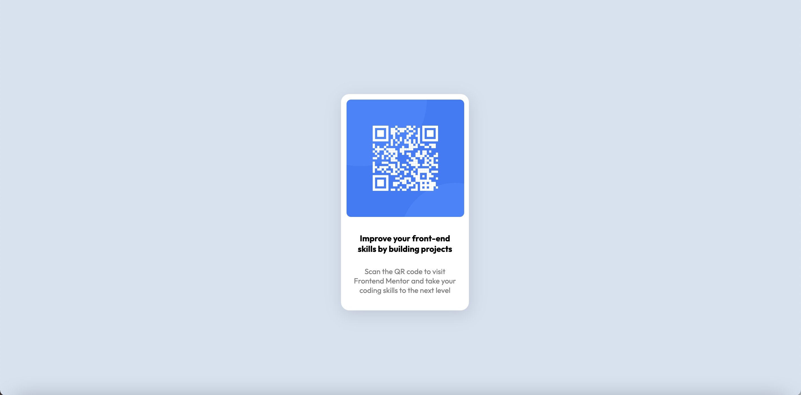

# Frontend Mentor - QR code component solution

This is a solution to the [QR code component challenge on Frontend Mentor](https://www.frontendmentor.io/challenges/qr-code-component-iux_sIO_H). Frontend Mentor challenges help you improve your coding skills by building realistic projects. 

## Table of contents

  - [Screenshot](#screenshot)
  - [Links](#links)
  - [Built with](#built-with)
  - [Continued development](#continued-development)
- [Developer](#developer)

### Screenshot

### Links

- Live Site URL: [Live Site](https://frontend-mentor-qr-code-jamesagib.vercel.app/)

### Built with

- HTML
- CSS
- Flexbox
- Mobile-first

### Continued development

This project took about an hour. I learned some new flexbox skills while building this qr-code component. 

## Developer

- James Agib 

